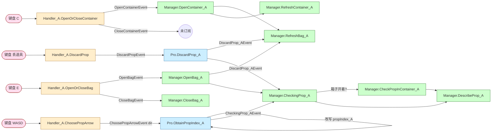
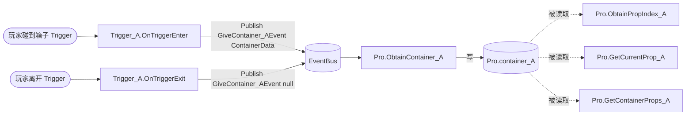
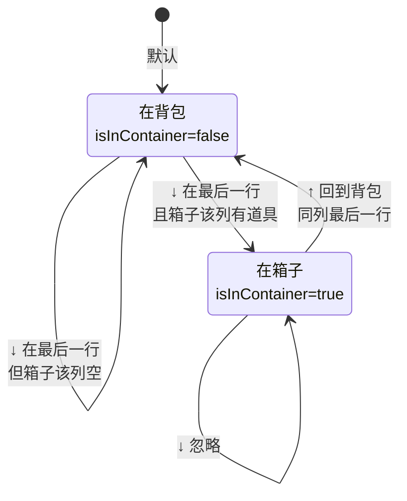

# 项目逻辑梳理（以 A 玩家背包/箱子为主线）

> 我（Claude）目前对项目核心交互流程的理解。请你看完后告诉我哪里理解错了。

---

## 1. 三层架构

```
[输入/状态层]  PlayingHandler_A         （MonoBehaviour，单例）
                ↓ 事件
[逻辑层]       PlayingUI_pro            （纯 C# 类，处理 index 计算、当前道具查询）
                ↓ 事件
[表现层]       PlayingUIManager         （MonoBehaviour，负责实际 UI 操作）
```

- **Handler**：监听键盘输入，把"按了什么"翻译成业务事件（`OpenBagEvent` / `ChoosePropArrowEvent` 等），同时维护交互状态（`isBagClosed`、`isContainerClosed`）。
- **Pro**：作为 Manager 与 Handler 之间的中间层。它订阅 Handler 的事件，做"光标该挪到哪个 index、当前选中的道具是哪个"这类计算，对外发出 `CheckingProp_AEvent` 和 `DiscardProp_AEvent`。它也持有 `container_A`（当前接触到的箱子数据）。
- **Manager**：订阅 Pro 的事件，操作 UI Toolkit 元素，做高亮、刷新、显示描述等。

数据本身（背包里的道具列表 `pcsc.GetBag_A()`、箱子里的道具 `container_A.GetAllProps()`）不归 Pro 管，Pro 只是查询。

---

## 2. 关键状态

### Handler_A
- `isBagClosed`：背包当前是否关着
- `isContainerClosed`：箱子当前是否关着
- `DisableOpenContainer`：是否在箱子触发器范围内（玩家走到箱子旁边才允许开箱子）

### Pro
- `propIndex_A`：当前光标位置（`Index { int index, bool isInContainer }`）
- `prevPropIndex_A`：上一帧的光标位置，用于"清掉旧高亮、画新高亮"
- `container_A`：当前接触到的箱子的 `ContainerData`（玩家走到箱子触发器时通过 `GiveContainer_AEvent` 被赋值；离开时被置 null）

### `Index` 结构体
- `index`：在所在容器里的下标（0起）
- `isInContainer`：**false = 光标在背包，true = 光标在箱子**

---

## 3. 输入到 UI 的事件链

### 3.1 开/关背包（按 E）

```
键盘E
  → Handler_A.OpenOrCloseBag           （切换 isBagClosed，启停 ChooseProp/DiscardProp 输入）
  → OpenBagEvent / CloseBagEvent
  → Manager.OpenBag_A / CloseBag_A     （Add/Remove BagUI，刷新，调一次 CheckingProp_A）
```

### 3.2 开/关箱子（按 C，仅当玩家在箱子触发器内）

```
键盘C
  → Handler_A.OpenOrCloseContainer     （切换 isContainerClosed，启停 ChooseProp/ReplaceProp 输入）
  → OpenContainerEvent / CloseContainerEvent
  → Manager.OpenContainer_A            （实例化 containerUI_A，刷新背包，刷新箱子）
```

**当前已知问题**：开箱子时背包没自动打开。游戏设计是"开箱子必同时开背包"，但 Handler 那边没顺带触发 `OpenBagEvent`，Manager 这边也没补。

### 3.3 选择道具（按 WASD 当且仅当背包或箱子开着）

```
WASD
  → Handler_A.ChoosePropArrow          （把 Vector2 离散化成 Vector2Int 方向）
  → ChoosePropArrowEvent(dir)
  → Pro.ObtainPropIndex_A(dir)         （根据 dir 算出新 propIndex_A）
       两种模式：
         a) isContainerClosed_A == true  → 纯背包模式（5列 N行）
         b) isContainerClosed_A == false → 背包+箱子模式（见下节）
  → CheckingProp_AEvent
  → Manager.CheckingProp_A             （刷新高亮和描述）
```

### 3.4 丢道具（按 R/Q 之类）

```
DiscardProp 输入
  → Handler_A.DiscardProp
  → DiscardPropEvent
  → Pro.DiscardProp_A                  （从背包移除，clamp index）
  → DiscardProp_AEvent
  → Manager.RefreshBag_A + Manager.CheckingProp_A
```

### 3.5 箱子数据来源（OnTrigger）

```
玩家碰到箱子的 Trigger
  → PlayingTrigger_A.OnTriggerEnter
  → EventBus.Publish(GiveContainer_AEvent(箱子的ContainerData))
  → Pro.ObtainContainer_A
  → container_A = 箱子数据

玩家离开 Trigger
  → EventBus.Publish(GiveContainer_AEvent(null))
  → container_A = null
```

---

## 4. 背包+箱子模式下的光标移动规则（你设计的）

**UI 布局假设**：上方 5 列 N 行的背包，下方 1 行 5 列的箱子。

| 当前位置 | 输入 | 行为 |
|---|---|---|
| 背包 | ←/→ | 在背包内循环 |
| 背包 | ↑ | 在背包内上下循环 |
| 背包（非最后一行） | ↓ | 在背包内向下 |
| 背包（最后一行） | ↓ | 若箱子同列有道具 → 跳到箱子对应格子（`isInContainer=true`）；否则跳回背包该列首行 |
| 箱子 | ←/→ | 在箱子内循环 |
| 箱子 | ↑ | 跳回背包同列最后一行（`isInContainer=false`） |
| 箱子 | ↓ | 忽略 |

---

## 5. 表现层（Manager）现有职责

| 函数 | 干什么 |
|---|---|
| `OpenBag_A` | 把 BagUI Add 到左侧，刷新格子，调 `CheckingProp_A` 画初始高亮 |
| `CloseBag_A` | 移除 BagUI，把 prev index 重置 |
| `RefreshBag_A` | 按 `pcsc.GetBag_A()` 重新生成背包格子（每个含 CheckingBackground 子元素） |
| `OpenContainer_A` | 实例化箱子UI，刷新背包，刷新箱子 |
| `RefreshContainer_A` | 把箱子UI放到 BottomPivot/_LeftPivot，给前 N 个格子设置道具图标 |
| `CheckingProp_A` | **当前混了两种模式**：箱子关着→走背包逻辑；箱子开着→转发给 `CheckPropInContainer_A` |
| `CheckPropInContainer_A` | 同时管两套高亮（背包格子改 CheckingBackground 的颜色；箱子格子直接改自身 backgroundColor） |
| `DescribeProp_A` | 显示当前选中道具的 name 和 describe |

---

## 6. 我知道的当前问题/待办

1. 开箱子没有同时打开背包（设计要求是同时开）
2. `CheckingProp_A` 内部转发给 `CheckPropInContainer_A`——你刚才说想分开调用，不要内部转发
3. `CheckingProp_A` 走背包逻辑分支时，没考虑当前 propIndex_A.isInContainer 为 true 的可能（例如关箱子瞬间光标如果还在箱子下标会越界）
4. `ReplaceProp_A`（按 R 在箱子和背包之间换道具）函数体是空的
5. B 玩家完全没有箱子相关逻辑
6. `CloseContainer_A` 没人订阅，关箱子后箱子UI不会被移除

---

## 7. 其它需要你确认的点

- **关箱子时光标应该回到背包吗？** 现在没处理。如果光标停在箱子时关了箱子，`propIndex_A.isInContainer` 还是 true，下次按方向键会走错分支。
- **箱子UI的5个格子是 UXML 自带的固定 5 个，不动态生成**——确认过了。
- **`PlayingTrigger_A.OnTriggerExit` 会把 container_A 设为 null**——这意味着玩家在开着箱子的情况下走出触发器范围，再按方向键试图操作箱子时 container_A 已经是 null 了。这种边界你想怎么处理？

---

## 8. 有向图

### 8.1 主事件流（A 玩家选道具/丢道具）



### 8.2 箱子数据来源链



### 8.3 光标移动状态机（开箱子模式下）



