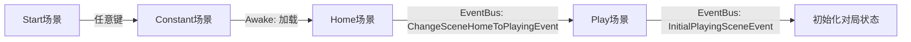
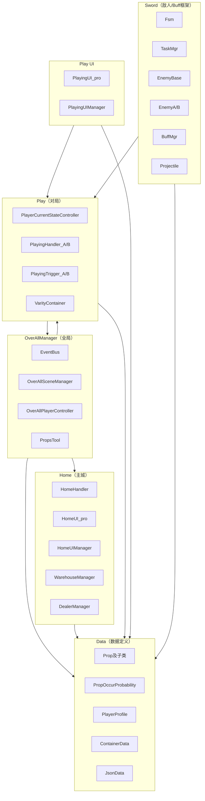
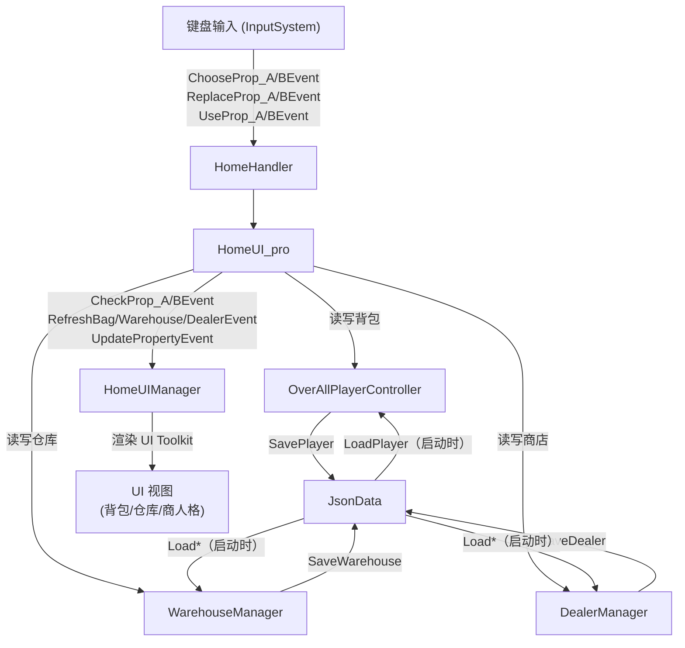
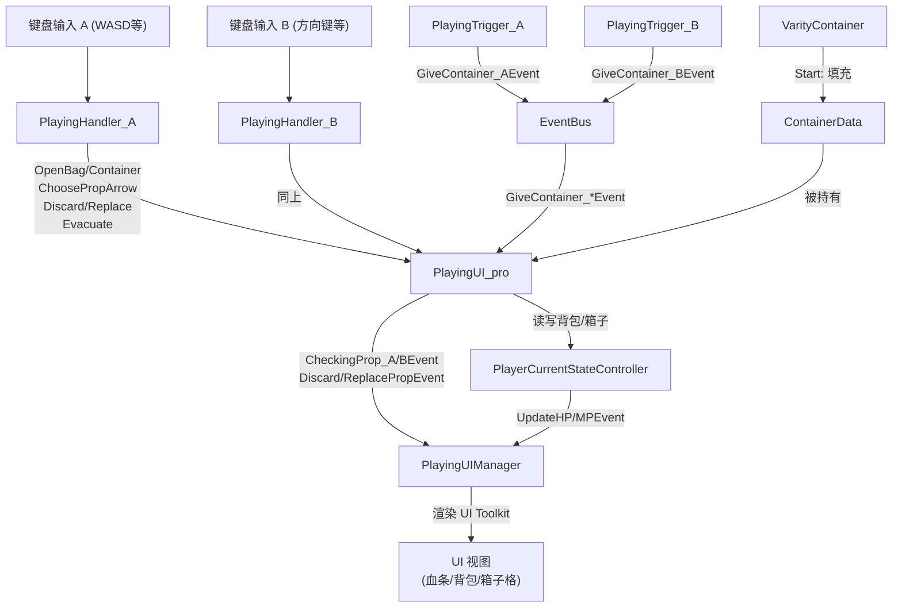
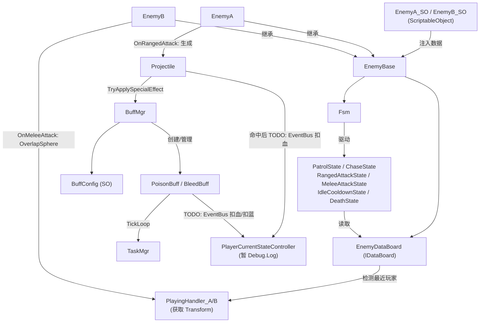
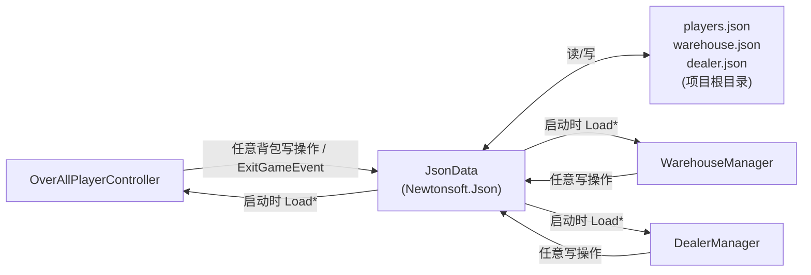

# AreYouMother 架构图

## 1. 场景流转

---

## 2. 整体模块依赖（顶层）

---

## 3. Home 场景：数据流与事件流

---

## 4. Play 场景：数据流与事件流

---

## 5. Sword 敌人系统（内部）

---

## 6. 数据持久化

---

## 关键设计说明

| 层 | 职责 | 说明 |
|---|---|---|
| `EventBus` | 全局解耦消息总线 | struct 泛型，零 GC |
| `*_pro` 类 | 业务逻辑与 UI 解耦层 | `HomeUI_pro` / `PlayingUI_pro` 不继承 MonoBehaviour，持有数据引用，暴露事件给 Manager |
| `*Manager` (MonoBehaviour) | 纯视图层 | 只渲染 UI Toolkit，订阅 pro 层事件 |
| `*Manager` (static) | 数据管理 | `WarehouseManager` / `DealerManager`，静态单例持有 List<Prop> |
| `Sword` 模块 | 独立 AI/Buff 框架 | 仅通过 `PropOwner` 和 `PlayingHandler` 与 Taffy 耦合；Buff 伤害尚未接入 EventBus（TODO） |
